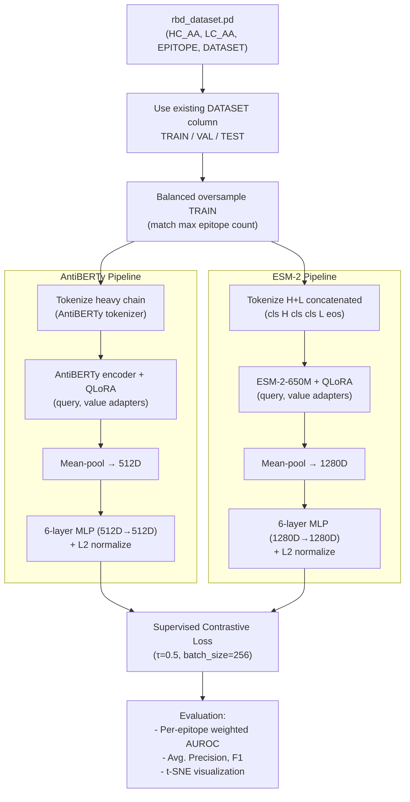

# Cross-Reference Corrections and Build Plan

## Part 1: Cross-Reference Issues (Paper vs. Implementation Plan)

I read the full Holt et al. paper, the implementation plan, the existing `ablang_model/train/` source code (the authors' actual training code), and the frozen baseline notebook. Here are the issues.

### Issue 1 (CRITICAL): AUROC Computation Method is Wrong in the Notebook

The **paper** uses a **per-epitope weighted AUROC** (implemented in [`ablang_model/train/analysis.py`](ablang_model/train/analysis.py) function `get_cross_dataset_weighted_rocauc`):
- For each of the 12 epitope classes, computes per-class TPR/FPR curves independently
- Weights each class by its proportion of positive pairs
- Averages the weighted curves, then computes AUC

The **notebook** uses `sklearn.roc_auc_score` which is a **global binary AUROC** (same-epitope = 1, different-epitope = 0), and it only does **test-vs-test** pairwise comparisons.

This explains why the notebook reports 0.812 for AbLangRBD1 while the paper reports 0.73 (test-vs-test) and 0.84 (train-vs-test) -- they are computing fundamentally different metrics.

**Fix:** Implement the paper's per-epitope weighted AUROC for all future evaluations. The existing code in `analysis.py` (`get_cross_dataset_weighted_rocauc`) can be adapted directly. We also need both evaluation modes:
- **Train-vs-test**: Compare test embeddings against train set embeddings (paper's primary metric, AUROC=0.84)
- **Test-vs-test**: Compare test embeddings against each other (paper's secondary metric, AUROC=0.73)

### Issue 2 (CRITICAL): AntiBERTy Hidden Dimension is 512D, Not 768D

The implementation plan's architecture diagram assumes AntiBERTy has 768D embeddings (like AbLang), but **AntiBERTy's hidden dimension is 512D**. This was confirmed in the frozen baseline notebook output.

With the decision to use heavy-chain only:
- AntiBERTy input to MLP: **512D** (not 1536D or 1024D)
- The 6-layer Mixer/MLP must be adapted: `Mixer(in_d=512)` instead of `Mixer(in_d=1536)`

### Issue 3 (MODERATE): ESM-2 Chain Handling Needs Clarification

The paper says for its frozen ESM-2 baseline:
> "the heavy and light chains were fed simultaneously, separated by two classification (CLS) tokens as done in Burbach and Briney"

This is the BALM concatenation approach -- feed `<cls> H_seq <cls> <cls> L_seq <eos>` as a single input to ESM-2, then mean-pool the full output to get a 1280D embedding. The notebook's frozen baseline only uses heavy chain (which is a simplification for the milestone).

For fine-tuning, we should match the paper's paired-input approach: both chains concatenated with CLS separator tokens, producing a **1280D** embedding, then into `Mixer(in_d=1280)`.

### Issue 4 (MODERATE): Contradictory CDRH3 Cutoff in the Plan

The plan says: "≥70% CDRH3 identity cutoff of 65%"

The paper uses **two different cutoffs for two different datasets**:
- **AbLang-RBD (DMS):** clusters defined by shared heavy V-gene AND **>70% CDRH3 identity**
- **AbLang-PDB (SAbDab):** clone groups at **>65% CDRH3 identity**

Since we are only doing the RBD task, the correct cutoff is **>70%**. But in practice, the existing `rbd_dataset.pd` already has a `DATASET` column with pre-computed TRAIN/TEST/VAL splits, so we should use those directly.

### Issue 5 (LOW): QLoRA Target Modules

The paper says QLoRA is applied but doesn't specify which modules. The actual code ([`ablang_model/train/get_run_specifics.py`](ablang_model/train/get_run_specifics.py)) reveals:

```python
'TARGET_MODULES': ["query", "value"]
```

LoRA is applied only to the **query and value** attention projection matrices. We need to find the equivalent module names in AntiBERTy and ESM-2 (they will be different string paths in their respective model architectures).

### Issue 6 (LOW): Balanced Sampling / Oversampling in Training

The paper doesn't emphasize this, but the code in [`ablang_model/train/data_handling.py`](ablang_model/train/data_handling.py) shows that training uses **epitope-balanced oversampling** (`oversample_epitope`) -- minority epitope classes are upsampled to match the largest class. This is important for the contrastive loss to work well with the imbalanced epitope distribution (e.g., E2.2 has 54 test antibodies while D2 has only 9).

---

## Part 2: Implementation Architecture

### Data Flow



### Key Hyperparameters (All From Paper/Code)

- **QLoRA:** r=16, alpha=32, dropout=0.3, target_modules=["query", "value"], bias="none"
- **Optimizer:** AdamW, lr=1e-5
- **Batch size:** 256
- **Temperature:** 0.5
- **Epochs:** 400 (checkpoint every 20 epochs; best selected by validation AUROC)

---

## Part 3: Files to Create/Modify

All new code goes in `src/`. We leverage the existing Holt et al. code in `ablang_model/train/` as reference but write clean implementations.

### `src/data_loader.py`
- Load `rbd_dataset.pd`, use existing DATASET column for splits
- Implement epitope-balanced oversampling for TRAIN (adapt from [`ablang_model/train/data_handling.py`](ablang_model/train/data_handling.py) `oversample_epitope`)
- Tokenize sequences: AntiBERTy tokenizer for heavy chain; ESM-2 tokenizer for H+L concatenated
- Return PyTorch DataLoaders with batch_size=256

### `src/models.py`
- `AntiBERTyContrastive`: loads AntiBERTy, injects QLoRA on query/value, adds 6-layer MLP (512D), L2-normalize
- `ESM2Contrastive`: loads ESM-2-650M, injects QLoRA on query/value, adds 6-layer MLP (1280D), L2-normalize
- Both follow the pattern in [`ablang_model/train/models.py`](ablang_model/train/models.py) `AbLangContrastive`

### `src/loss.py`
- Port `ContrastiveLoss` from [`ablang_model/train/models.py`](ablang_model/train/models.py) (lines 208-244) -- already clean and correct
- Port `ContrastiveTrainTestLoss` for evaluation (lines 135-205)

### `src/train.py`
- Training loop adapted from [`ablang_model/train/run_simclr_250129.py`](ablang_model/train/run_simclr_250129.py) `training_loop_contrastive`
- CLI args: `--encoder {antiberty, esm2}`, `--epochs`, `--batch_size`, `--output_dir`
- Checkpoint saving every 20 epochs; validation AUROC tracking
- Mixed precision support for Colab A100/G4

### `src/evaluate.py`
- Port `get_cross_dataset_weighted_rocauc` from [`ablang_model/train/analysis.py`](ablang_model/train/analysis.py) (lines 440-500)
- Implement both train-vs-test and test-vs-test evaluation modes
- Average precision, F1, t-SNE visualization

---

## Part 4: Compute Considerations (Colab Pro)

- **AntiBERTy** (~26M params): Light model, batch_size=256 should fit easily on T4 (16GB) or A100
- **ESM-2-650M**: Larger model. With QLoRA (4-bit quantization), batch_size=256 should fit on A100 (40GB). On T4 (16GB), may need batch_size=128 or gradient accumulation
- Training will be done via Colab notebooks that import from `src/`
- Estimated training time: AntiBERTy ~2-3 hours, ESM-2 ~5-8 hours (both on A100)
