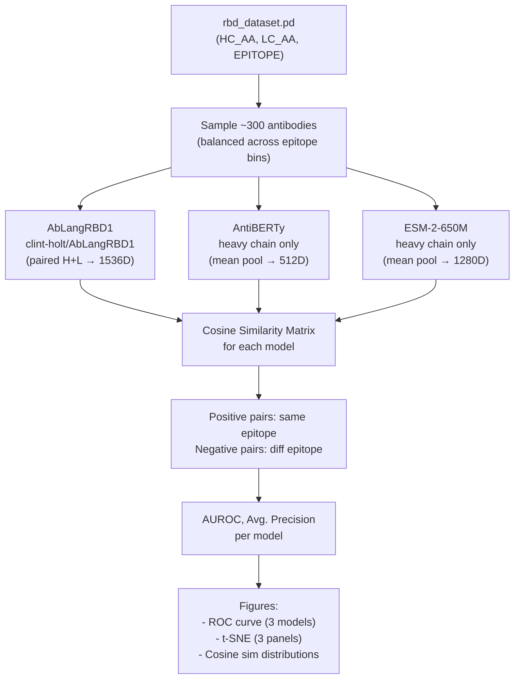

# Milestone Baseline Evaluation Plan

## Goal

Produce preliminary results showing AbLangRBD1 (fine-tuned) dramatically outperforms frozen AntiBERTy and ESM-2 on epitope-pair classification — enough to submit a credible 2-page milestone.

## Architecture




## What We're Building: One Notebook

`**[notebooks/01_frozen_baseline.ipynb](notebooks/01_frozen_baseline.ipynb)**`

### Cell-by-Cell Plan

**Cell 1 — Imports and setup**

- `torch`, `pandas`, `numpy`, `sklearn`, `matplotlib`, `seaborn`, `umap-learn`

**Cell 2 — Load and sample data from `rbd_dataset.pd`**

- `df = pd.read_pickle("ablang_model/train/rbd_dataset.pd")`
- Inspect columns (expected: `HC_AA`, `LC_AA`, `EPITOPE`, possibly `DATASET`)
- Sample ~300 sequences balanced across epitope bins using `df.groupby("EPITOPE").sample(n=25)` (or whatever fits)
- Store epitope integer labels

**Cell 3 — AbLangRBD1 embeddings**

- Use existing `[ablang_model/Inference/ablangpaired_model.py](ablang_model/Inference/ablangpaired_model.py)` code
- Download weights from `clint-holt/AbLangRBD1` via `hf_hub_download`
- Load `AbLangPairedConfig` + `AbLangPaired`, tokenize H+L with space-separated AAs, batch inference
- Output: `ablang_embeddings` — shape `(N, 1536)`, already L2-normalized

**Cell 4 — AntiBERTy embeddings**

```python
from antiberty import AntiBERTyRunner
runner = AntiBERTyRunner()
raw = runner.embed(heavy_seqs)  # per-residue, list of (L, 512) tensors
antiberty_embeddings = torch.stack([t.mean(0) for t in raw])
antiberty_embeddings = F.normalize(antiberty_embeddings, dim=1)
```

- Heavy chain only (mirrors Holt et al.'s frozen AntiBERTy baseline)

**Cell 5 — ESM-2 embeddings**

```python
from transformers import AutoTokenizer, AutoModel
tok = AutoTokenizer.from_pretrained("facebook/esm2_t33_650M_UR50D")
esm = AutoModel.from_pretrained("facebook/esm2_t33_650M_UR50D")
# batch tokenize heavy seqs, mean pool last_hidden_state over non-padding positions
esm_embeddings = F.normalize(mean_pooled, dim=1)
```

- Heavy chain only (matching Holt et al.)

**Cell 6 — Build positive/negative pair labels**

```python
label_mat = (labels[:, None] == labels[None, :])  # (N, N) bool
# Flatten upper triangle → y_true (1 = same epitope, 0 = different)
# Corresponding cosine sims → y_score
```

**Cell 7 — Compute AUROC and Avg. Precision for each model**

```python
from sklearn.metrics import roc_auc_score, average_precision_score, roc_curve
```

- Produces the key table matching Holt et al.'s Table 1 format

**Cell 8 — Figure 1: ROC curves (3 models on one plot)**

- `plt.plot(fpr, tpr, label=f"AbLangRBD1 (AUROC={auroc:.2f})")` etc.

**Cell 9 — Figure 2: t-SNE visualization (3 panels side by side)**

```python
from sklearn.manifold import TSNE
# One TSNE per embedding matrix, scatter colored by epitope bin
```

**Cell 10 — Figure 3: Cosine similarity distributions**

- Violin or KDE plot of same-epitope vs. different-epitope cosine sims for each model
- Makes the germline bias argument visual

**Cell 11 — Summary table**

- Print/display Markdown table: Model | AUROC | Avg. Precision
- Expected result: AbLangRBD1 ~0.84, AntiBERTy ~0.57, ESM-2 ~0.56

## Key Files Touched

- **New:** `[notebooks/01_frozen_baseline.ipynb](notebooks/01_frozen_baseline.ipynb)` — the only new file
- **Read:** `[ablang_model/Inference/ablangpaired_model.py](ablang_model/Inference/ablangpaired_model.py)` — reuse as-is
- **Read:** `[ablang_model/train/rbd_dataset.pd](ablang_model/train/rbd_dataset.pd)` — source of test sequences

## Dependencies to verify are installed

`antiberty`, `fair-esm` (or `esm` via transformers), `huggingface_hub`, `safetensors`, `umap-learn`

## Notes / Risks

- `rbd_dataset.pd` columns need inspection first — if `DATASET` column exists, use `DATASET=="TEST"` rows; otherwise random-sample
- AntiBERTy `runner.embed()` may return per-residue tensors (shape `(L, 512)`) — need to mean-pool manually
- ESM-2-650M is ~2.5GB download; may want `esm2_t6_8M_UR50D` if memory-constrained on a laptop (still conceptually valid for a baseline)
- AbLangRBD1 downloads ~738MB weights; cache in repo root or `ablang_model/Inference/`
- For the milestone write-up, the "preliminary results" are whatever AUROC numbers come out; even if AbLangRBD1 doesn't perfectly match 0.84 (due to sampling), the directional comparison is what matters
